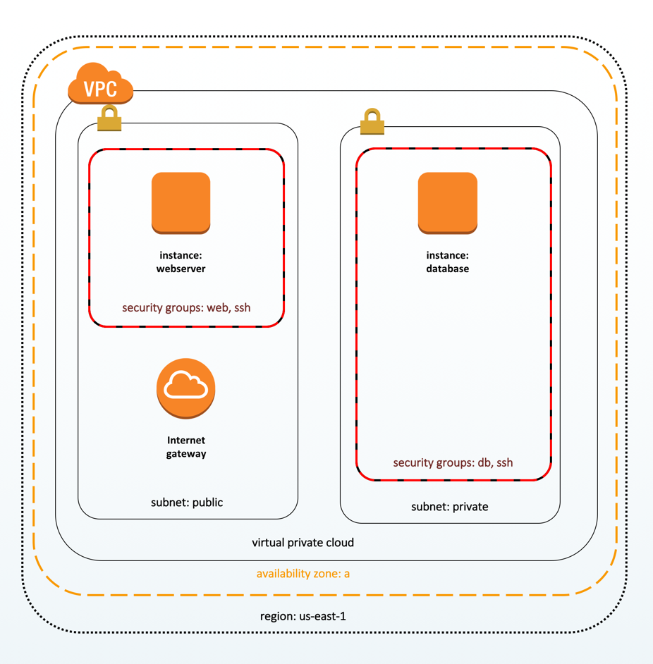
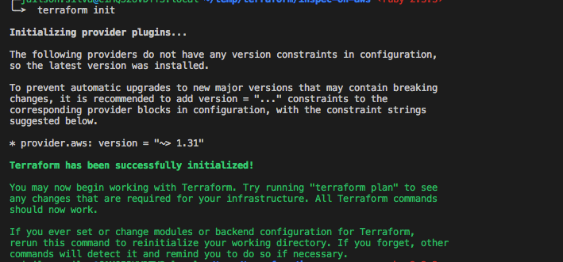
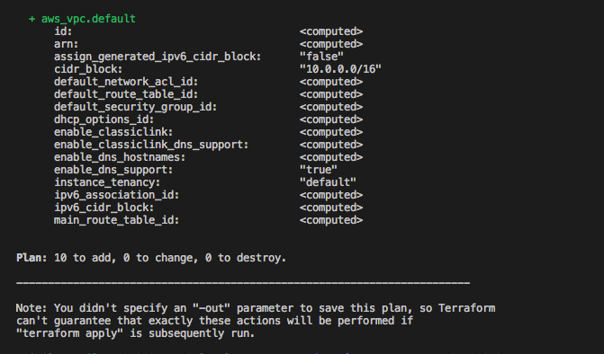
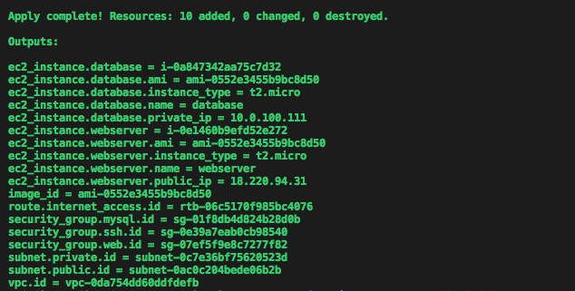
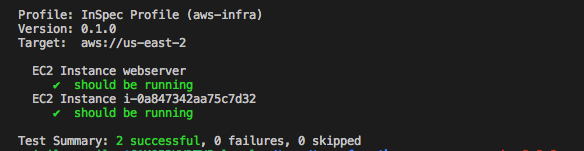
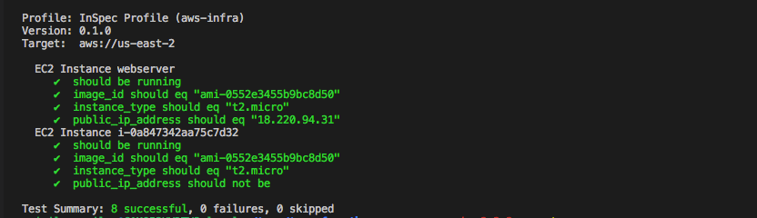
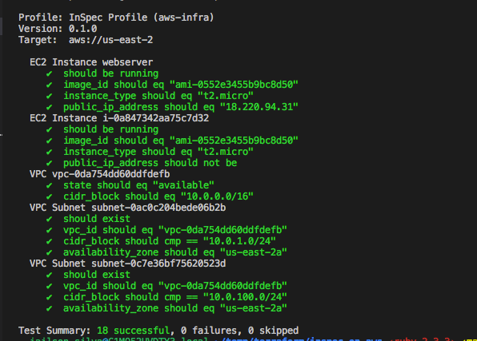
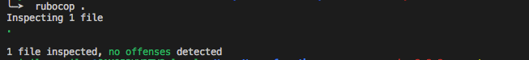

# Learn Terraform and InSpec

*Hands-on* com o básico de Terraform e Inspec

# Pré-requisitos

## Conta na AWS
 - Usuário na AWS com access key e secret key
 - Terraform 0.11.3 ou superior - [Terraform](https://www.terraform.io/)
 - Inspec 2.0.17 ou superior - [Inspec for AWS](https://www.inspec.io/downloads/)
 - Inspec configurado para ler as credenciais da AWS.

# Set up de ambiente:

## Repositório.

Clonar este repositório 

```
git clone https://github.com/jailson-silva/learn-terraform
```

Entrar no diretório inspec-on-aws.

```
cd inspec-on-aws/
```

O projeto define uma configuração de duas instâncias EC2 e suas configurações de segurança e rede relacionadas. Vamos precisar criar um arquivo que especifique como acessar a conta da AWS.

Para fazer isso basta criar um arquivo chamado terraform.tfvars com as seguintes informações:

```
aws_access_key =  “xxxxxxxxxx"
aws_secret_key =  “xxxxxxxxxxxxxxxxxxxxxx"
aws_region = "us-east-2"
aws_availability_zone = "a"
```

Alterar:
* aws_access_key e aws_secret_key com sua AWS access key ID e secret key.
* aws_region e aws_availability_zone com sua region e availability zone.

# Criando a Infraestrutura.

Nesta parte, vamos criar a infraestrutura na AWS usando o Terraform.
O Terraform cria a infraestrutura na AWS, isso é feito através de um arquivo que descreve a configuração desejada. Este arquivo é geralmente chamado main.tf.

```
inspec-on-aws/main.tf
```

Aqui está um diagrama da topologia de infraestrutura que iremos criar.




A VPC contém duas subnets, uma para tráfego público e outra para tráfego somente na rede privada.

Três Security Group com entrada nas portas 22 (SSH), 80 (HTTP) e 3306 (MySQL).

Duas instâncias EC2 (Ubuntu 16.04) que será o servidor web e o servidor de banco de dados.

O servidor da Web será alocado na subnet pública para que possa receber tráfego da rede pública nas portas 22 e 80.

O servidor de banco de dados será alocado na subnet privada para que possa receber tráfego apenas da rede interna nas portas 22 e 3306.

Inicialize o Terraform

O Terraform suporta uma variedade de provedores.

Iniciando o terraform:

```
terrafom init
```



O Terraform instala o plugin da AWS com base no provider do Terraform configurado nos arquivos .tfs do diretório atual.

Verificar o que será criado.

Antes de você executar o terraform apply para criar sua infraestrutura, é uma boa ideia executar o terraform plan para verificar quais recursos o terraform irá criar.

Output do terraform plan:

```
terraform plan
```



Se o output do plan estiver de acordo com o que deseja, podemos executar o terraform apply.

Output do Terraform Apply



Com a infraestrutura criada e com os _outputs_ configurados podemos escrever nossos testes.

# Verificando a nossa Infraestrutura

Iremos escrever alguns testes integração para a nossa infra utilizando o [Inspec for AWS](https://www.inspec.io/downloads/).

Para isso temos que criar um profile local onde será desenvolvido nossos testes:

```
inspec init profile aws-infra
```

Este comando vai criar um diretorio com o nome do profile "aws-infra" e um aquivo com exemplos de alguns testes, podemos remover uma vez que não iremos utilizá-lo.

```
rm aws-infra/controls/example.rb
```

Agora vamos criar um novo arquivo com o nome instances.rb e adicionar os nossos testes:

```
vim aws-infra/controls/instances.rb
```

Agora vamos adicionar o conteúdo com os resources do inspec [Inspec Resources for AWS](https://www.inspec.io/docs/reference/resources/#aws-resources/)

```
describe aws_ec2_instance(name: 'webserver') do
    it { should be_running }
end

describe aws_ec2_instance('_instance_id_') do
    it { should be_running }
end
```

Lembrando de alterar o "intance_id" com o instance ID da instancia mysql que foi criada, para isso voce terá de acessar o console da AWS.

Esses testes verificam se as instâncias do EC2 estão em execução.

O recurso aws_ec2_instance pode encontrar uma instância utilizando a tag Name o ID da instância, entao podemos aproveitar está *feature*.

O primeiro teste verifica se existe uma instancia com a tag Name "webserver' e se ela esta "running"

O segundo teste verifica se existe do servidor de banco de dados baseado no ID da instância database.

Agora vamos analisar nosse infra-estrutura. Lembrando que InSpec específica um destino quando você executa um scan. Normalmente precisamos incluir um protocolo (SSH, WinRM ou Docker) junto com detalhes da conexão (um nome de usuário e senha ou arquivo de chave privada), neste caso iremos utilizar a chave da AWS.

Sendo assim, iremos utilizar o formato aws://REGION/PROFILE para especificar a os detalhes e credenciais da nossa conexão com a AWS.

Vamos executar o inspec exec e verificar se a infraestrutura da AWS está de acordo com o desejado. Lembrando de substituir **us-east-1/terraform** pela sua região e profile da AWS.

```
inspec exec aws-infra -t aws://us-east-2/terraform
```

Como podemos ver os testes tiveram sucesso.



Se você receber um erro, verifique se o InSpec está configurado para ler suas credenciais da AWS.

Os resultados do teste mostram que ambas as instâncias estão em execução. Este teste é um ótimo começo, mas não verifica se os servidores foram criados a partir da imagem correta por exemplo, ou se está sendo executada no tamanho correto ou até mesmo se possui o endereço IP esperado.

Lembrando que no terraform output já temos todas estas informações.

No Terraform especificamos a sub-rede pública para o servidor Web e a sub-rede privada para o banco de dados. Portanto, no servidor web é atribuído a um endereço IP público e o servidor de banco de dados é atribuído a um endereço na rede privada. Vamos testar estes detallhes também:

Vamos atualizar nosso _control file_ e incluir os testes para verificar a AMI de cada instância, o seu tamanho e o endereço IP. Aqui está um exemplo. Substitua o ID da AMI, o ID da instância do servidor de banco de dados e o endereço IP do servidor web, lembrando estes dados podem ser coletados no console da AWS.

```
# Informacoes do servidor Web
describe aws_ec2_instance(name: 'webserver') do
    it { should be_running }
    its('image_id') { should eq 'ami-0552e3455b9bc8d50' }
    its('instance_type') { should eq 't2.micro' }
    its('public_ip_address') { should eq '18.220.94.31' }
end

# Informacoes do servidor DB
describe aws_ec2_instance('i-0a16ffc255e104920') do
    it { should be_running }
    its('image_id') { should eq 'ami-0552e3455b9bc8d50' }
    its('instance_type') { should eq 't2.micro' }
    its('public_ip_address') { should_not be }
end
```

E novamente nossos testes passaram:



## Verificando VPC e Subnetes

Todas as instâncias precisam de uma VPC para rodar, uma VPC define uma lista de endereços IP dentro dessa rede interna.

Vamos modificar nosso controle para testar a nossa VPC adicionando o seguinte código.

```
describe aws_vpc('vpc-0da754dd60ddfdefb') do
  its('state') { should eq 'available' }
  its('cidr_block') { should eq '10.0.0.0/16' }
end
```

No terraform definimos uma subnet dentro do VPC, vamos testar também.

```
describe aws_subnet('subnet-0ac0c204bede06b2b') do
  it { should exist }
  its('vpc_id') { should eq 'vpc-0da754dd60ddfdefb' }
  its('cidr_block') { should cmp '10.0.1.0/24' }
  its('availability_zone') { should eq 'us-east-2a' }
end

describe aws_subnet('subnet-0c7e36bf75620523d') do
  it { should exist }
  its('vpc_id') { should eq 'vpc-0da754dd60ddfdefb' }
  its('cidr_block') { should cmp '10.0.100.0/24' }
  its('availability_zone') { should eq 'us-east-2a' }
end
```

Vamos testar nossos SG, porque não:

```
describe aws_security_group('sg-01f8db4d824b28d0b') do
  it { should exist }
end

describe aws_security_group('sg-07ef5f9e8c7277f82') do
  it { should exist }
end

describe aws_security_group('sg-0e39a7eab0cb98540') do
  it { should exist }
end
```


Até agora sucesso em todos os nossos testes.



# Refatorando nossos testes

Até agora tudo bem, mas podemos melhorar, ter que sempre ir no console da AWS e repassar os IDs dos recursos não é uma tarefa eficiente e toma muito tempo, seria interassante automatizá-la.

Há duas maneiras de tornar os testes mais fáceis e reutilizáveis, são eles o **profile attributes** e **files profile**, vamos ver os dois.

## Attributes Profile

Ao rodar o inspec exec para executar os testes podemos utilizar o argumento _--attrs_ especificando um arquivo com todas as informaçõs que precisaremos.

Primeiro vamos criar este arquivo:

```
terraform output | sed s/=/:/g > attributes.yml
```

Agora podemos ir no início do nosso _control file_ e definir os seguintes atributos.

```
webserver_name = attribute('ec2_instance.webserver.name', description: 'WebServer Name')
database_id = attribute('ec2_instance.database', description: 'Web server ID')
image_id = attribute('image_id', description: 'Ubuntu 16.04 AMI ID')
vpc_id = attribute('vpc.id', description: 'VPC ID')
subnet_id = attribute('subnet.public.id', description: 'Subnet ID')
security_group_ssh_id = attribute('security_group.ssh.id', description: 'Security group ID for SSH')
security_group_web_id = attribute('security_group.web.id', description: 'Security group ID for HTTP')
public_ip = attribute('ec2_instance.webserver.public_ip', description: 'Public Webserver IP')
```

Agora vamos substituir primeiro o recurso aws_ec2_instance que é referente a nosso servidor web.

```
# Informacoes do servidor Web
describe aws_ec2_instance(name: webserver_name) do
  it { should be_running }
  its('image_id') { should eq image_id }
  its('instance_type') { should eq 't2.micro' }
  its('security_group_ids') { should include security_group_ssh_id }
  its('security_group_ids') { should include security_group_web_id }
  its('public_ip_address') { should eq public_ip }
end
```

E podemos alterar outras informações pelos valores que estão nos nossos atributos:

```
webserver_name = attribute('ec2_instance.webserver.name', description: 'WebServer Name')
database_id = attribute('ec2_instance.database', description: 'Web server ID')
image_id = attribute('image_id', description: 'Ubuntu 16.04 AMI ID')
vpc_id = attribute('vpc.id', description: 'VPC ID')
subnet_id = attribute('subnet.public.id', description: 'Subnet ID')
security_group_ssh_id = attribute('security_group.ssh.id', description: 'Security group ID for SSH')
security_group_web_id = attribute('security_group.web.id', description: 'Security group ID for HTTP')
public_ip = attribute('ec2_instance.webserver.public_ip', description: 'Public Webserver IP')

# Informacoes do servidor Web
describe aws_ec2_instance(name: webserver_name) do
  it { should be_running }
  its('image_id') { should eq image_id }
  its('instance_type') { should eq 't2.micro' }
  its('security_group_ids') { should include security_group_ssh_id }
  its('security_group_ids') { should include security_group_web_id }
  its('public_ip_address') { should eq public_ip }
end

# Informacoes do servidor DB
describe aws_ec2_instance(database_id) do
  it { should be_running }
  its('image_id') { should eq image_id }
  its('instance_type') { should eq 't2.micro' }
  its('public_ip_address') { should_not be }
end

describe aws_vpc(vpc_id) do
  its('state') { should eq 'available' }
  its('cidr_block') { should eq '10.0.0.0/16' }
end

describe aws_subnet('subnet-0ac0c204bede06b2b') do
  it { should exist }
  its('vpc_id') { should eq vpc_id }
  its('cidr_block') { should cmp '10.0.1.0/24' }
  its('availability_zone') { should eq 'us-east-2a' }
end

describe aws_subnet('subnet-0c7e36bf75620523d') do
  it { should exist }
  its('vpc_id') { should eq vpc_id }
  its('cidr_block') { should cmp '10.0.100.0/24' }
  its('availability_zone') { should eq 'us-east-2a' }
end

describe aws_security_group('sg-01f8db4d824b28d0b') do
  it { should exist }
end

describe aws_security_group('sg-07ef5f9e8c7277f82') do
  it { should exist }
end

describe aws_security_group('sg-0e39a7eab0cb98540') do
  it { should exist }
end
```

## Profiles files

Para grandes ambientes na AWS, seria melhor armazenar dados sobre o ambiente junto com seu profile do inspec, e para fazer isso podemos utilizar o _profile file_.

O _profile file_ é armazenado no diretório de arquivos do projeto. Um _profile file_ pode estar em qualquer formato não apenas em YAML.

Vamos criar um diretório chamado aws-infra/files.

```
mkdir -p  aws-infra/files
```

Após isso vamos exportar os nossos _outputs_ do terraform porém destá vez no formato json.

```
terraform output --json > aws-infra/files/terraform.json
```

Agora temos que modificar nosso _control file_ para carregar as informações do nosso servidor web baseado no arquivo terraform.json que acabamos de criar.

O código abaixo é um ruby que faz um parser do terraform.json.

```
content = inspec.profile.file("terraform.json")
params = JSON.parse(content)

webserver_name = params['ec2_instance.webserver.name']['value']
database_id = params['ec2_instance.database']['value']
image_id = params['image_id']['value']
vpc_id = params['vpc.id']['value']
subnet_public_id = params['subnet.public.id']['value']
security_group_ssh_id = params['security_group.ssh.id']['value']
security_group_web_id = params['security_group.web.id']['value']
public_ip = params['ec2_instance.webserver.public_ip']['value']
```

O conteúdo é carregado através do método inspec.profile.file. Este conteúdo é uma string que contém o arquivo JSON. A classe que analisa o JSON do Ruby converte o conteúdo em um _Hash_.

Agora podemos alterar os ids dos recursos pelas suas respectivas variáveis.

Exemplo:

```
describe aws_ec2_instance(name: webserver_name) do
  it { should be_running }
  its('image_id') { should eq image_id }
  its('instance_type') { should eq 't2.micro' }
  its('security_group_ids') { should include security_group_ssh_id }
  its('security_group_ids') { should include security_group_web_id }
  its('public_ip_address') { should eq public_ip }
end
```

Depois só rodar os testes novamente, porém agora não precisaremos passar o arqumento _—-attrs_.

```
inspec exec aws-infra -t aws://us-east-2/terraform
```

Novamente nossos testes passaram, porém agora temos todo o processo automatizado e não precisaremos nos precoucupar com as alterações dos IDs dos recursos, estes serão importados para dentro do teste baseado no arquivo terraform.json, que por sua vez é os _outputs_ do Terraform.

Vamos aproveitar agora e alterar todos os outros testes, ao inves de IDs passaremos para variáveis.

O arquivo final será bem parecido com o código abaixo:

```
# copyright: 2018, The Authors

title 'Teste EC2'

content = inspec.profile.file('terraform.json')
params = JSON.parse(content)

webserver_name = params['ec2_instance.webserver.name']['value']
database_id = params['ec2_instance.database']['value']
image_id = params['image_id']['value']
vpc_id = params['vpc.id']['value']
subnet_public_id = params['subnet.public.id']['value']
security_group_mysql_id = params['security_group.mysql.id']['value']
security_group_ssh_id = params['security_group.ssh.id']['value']
security_group_web_id = params['security_group.web.id']['value']
public_ip = params['ec2_instance.webserver.public_ip']['value']

# Informacoes do servidor Web
describe aws_ec2_instance(name: webserver_name) do
  it { should be_running }
  its('image_id') { should eq image_id }
  its('instance_type') { should eq 't2.micro' }
  its('security_group_ids') { should include security_group_ssh_id }
  its('security_group_ids') { should include security_group_web_id }
  its('public_ip_address') { should eq public_ip }
end

# Informacoes do servidor DB
describe aws_ec2_instance(database_id) do
  it { should be_running }
  its('image_id') { should eq image_id }
  its('instance_type') { should eq 't2.micro' }
  its('public_ip_address') { should_not be }
end
```

E como valorizamos um codigo bem escrito, vamos rodar o rubocop e verificar se temos alguma ofensa que temos de acertar.

```
rubocop .
```



